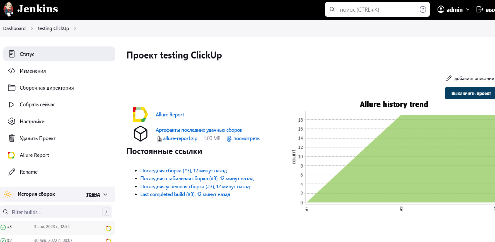

## Реализован следующий тест-кейс:
## Открыть интернет страницу  https://clickup.com/ 
### Результат:
### Открывается начальная страница.
### В поле Contact Sales нажать кнопку  Log in
### Результат:
### Открывается LogPage для  ввода Email и Password
### Тестируем элементы  данной станицы.
### 1.1  Вводим невалидный Email.
### Результат:
### Появляется надпись    This email is invalid!
### 1.2 Вводим корректный Email и некорректный  Password
### Результат:
### Появляется надпись    Incorrect password for this email.
### 1.3 Не вводим Email и Password и нажимаем Log in
### Результат:
### Появляется надпись   Email required!  и Password required!
### 1.4 Вводим некорректный Email и корректный Password
### Результат:
### Появляется надпись    No account for this email
### 1.5 Вводим Email  и не  вводим Password
### Результат:
### Появляется надпись   Password required!
### 1.6 Не вводим Email  и  вводим Password
### Результат:
### Появляется надпись  Email required!
### 1.7 Вводим невалидный Password
### Результат:
### Появляется надпись   Password must be 8 characters or longer!
### 1.8 Вводим корректный Email и корректный Password
### Для проверки  результата проверяем  надпись на главной странице
### Home под основной надписью  ClickUp

## После ввода корректного Email и корректного Password переходим на главную страницу.
### 1.1 Тестируем кнопку Create List
### 1.2 Тестируем название Home
### 1.3 Тестируем название Trending после нажатия на название Home
### 1.4 Тестируем окно InvitePeople после нажатия название Invite

## Результат
